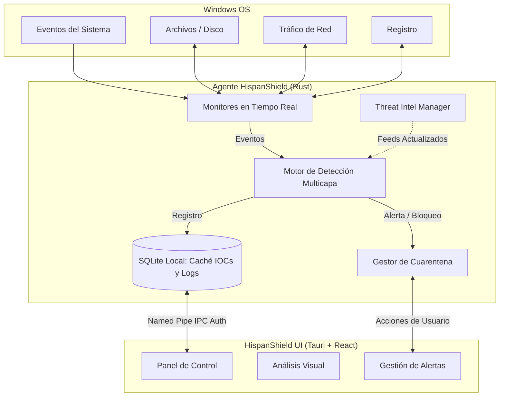
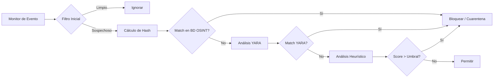

<div align="center">
  
  
  # 🛡️ HispanShield Antivirus
  
  **El Antivirus de Código Abierto para Windows 10/11 impulsado por Rust y OSINT**

  [](https://github.com/murdok1982/HispanShield-antivirus-for-Windows/actions/workflows/build.yml)
  [](https://www.gnu.org/licenses/gpl-3.0)
  [](https://www.microsoft.com/windows)
  [](https://github.com/murdok1982/HispanShield-antivirus-for-Windows/releases)
  [](https://www.rust-lang.org)
  [](http://makeapullrequest.com)

  *Combina Inteligencia de Amenazas (OSINT), Reglas YARA, Heurísticas y Monitoreo en Tiempo Real para proteger tus sistemas de manera completamente **offline** y sin telemetría.*
</div>

---

## 📑 Tabla de Contenidos

- [✨ Características Principales](#-características-principales)
- [🏗️ Arquitectura y Flujo de Trabajo](#-arquitectura-y-flujo-de-trabajo)
- [🧩 Módulos del Sistema](#-módulos-del-sistema)
- [⚙️ Requisitos del Sistema](#️-requisitos-del-sistema)
- [🚀 Instalación y Uso](#-instalación-y-uso)
- [📡 Feeds de Threat Intelligence](#-feeds-de-threat-intelligence)
- [🤝 Cómo Contribuir](#-cómo-contribuir)
- [💰 Apoya mi trabajo de código abierto](#-apoya-mi-trabajo-de-código-abierto)
- [📄 Licencia](#-licencia)

---

## ✨ Características Principales

<details open>
<summary><b>🛡️ Protección en Tiempo Real</b></summary>
<br>

- Monitoreo del sistema de archivos (`ReadDirectoryChanges`) con escaneo al vuelo.
- Monitor de procesos con detección de LOLBins y jerarquías sospechosas.
- Detección de persistencia en el Registro de Windows (Autorun).
- Monitoreo de conexiones de red cruzando datos con IPs/dominios de C2.
</details>

<details open>
<summary><b>🧠 Motor de Detección Multicapa</b></summary>
<br>

- Coincidencias exactas (Hash Matching: SHA-256, SHA-1, MD5).
- Análisis profundo con **Reglas YARA** para malware, ransomware y frameworks de C2.
- Motor heurístico por puntuación (Scoring System: 0-100).
- Detección de patrones de ransomware (renombrado masivo).
</details>

<details open>
<summary><b>🔒 Privacidad y Seguridad Total</b></summary>
<br>

- Operación **100% Offline** (sin telemetría forzada a la nube).
- Comunicación IPC segura y autenticada (HMAC-SHA256).
- Gestión de cuarentena protegida por Listas de Control de Acceso (DACL).
- Interfaz moderna e intuitiva en Tauri 2 + React.
</details>

---

## 🏗️ Arquitectura y Flujo de Trabajo

El sistema está dividido en dos componentes principales: el **Agente** (un servicio de Windows en Rust de alto rendimiento) y la **Interfaz Gráfica** (construida con Tauri y React).

### Mapa Conceptual del Sistema



### Arquitectura de Detección (Motor Interno)



---

## ⚙️ Requisitos del Sistema

| Componente          | Requisito Mínimo                 |
|---------------------|----------------------------------|
| **OS**              | Windows 10 x64 (build 1903+) / Windows 11 |
| **Arquitectura**    | x86_64 (AMD64)                   |
| **RAM**             | 512 MB disponibles               |
| **Disco**           | 200 MB (+ espacio de cuarentena) |
| **Privilegios**     | Administrador (para el Agente)   |
| **Dependencias**    | Ninguna (Binario estático)       |

---

## 🚀 Instalación y Uso

### 1️⃣ Método Recomendado: Instalador Rápido (MSI)

1. Ve a la página de [Releases](https://github.com/murdok1982/HispanShield-antivirus-for-Windows/releases) y descarga `HispanShield-0.1.0.msi`.
2. Ejecuta el instalador con privilegios de **Administrador**.
3. El servicio en segundo plano (`HispanShieldAgent`) se iniciará automáticamente.
4. Abre la interfaz gráfica desde el acceso directo en tu escritorio.

### 2️⃣ Método para Desarrolladores: Compilación y PowerShell

Si deseas compilarlo desde el código fuente y aplicar el script de despliegue:

```powershell
# 1. Clonar el repositorio
git clone https://github.com/murdok1982/HispanShield-antivirus-for-Windows.git
cd HispanShield-antivirus-for-Windows

# 2. Compilar (Requiere Rust y Node.js)
cargo build --release

# 3. Instalar el servicio
Set-ExecutionPolicy RemoteSigned -Scope Process
.\installer\scripts\install.ps1
```

> **Para desinstalar:** Ejecuta `.\installer\scripts\install.ps1 -Uninstall` desde PowerShell como Administrador.

---

## 📡 Feeds de Threat Intelligence

HispanShield integra feeds públicos de seguridad ofensiva para enriquecer su base de datos local automáticamente:

| Fuente / Feed         | Proveedor  | Tipo de IOC (Indicadores) | Frecuencia de Actualización |
|-----------------------|------------|---------------------------|-----------------------------|
| **MalwareBazaar**     | abuse.ch   | Hashes (SHA256, MD5)      | Cada 24h                    |
| **ThreatFox**         | abuse.ch   | IPs, Dominios, URLs       | Cada 12h                    |
| **URLhaus**           | abuse.ch   | URLs maliciosas           | Cada 6h                     |
| **Feodo Tracker**     | abuse.ch   | IPs y Dominios C2         | Cada 6h                     |
| **SSL Blacklist**     | abuse.ch   | Certificados de C2        | Cada 12h                    |
| **MISP Warninglists** | MISP       | Allowlist (Alexa, MS)     | Cada 7 días                 |

---

## 🤝 Cómo Contribuir

¡Hacer de HispanShield el mejor Antivirus Open Source en Rust es un trabajo de comunidad! Todos los aportes son bienvenidos.

### Pasos para contribuir:

1. Realiza un **Fork** de este repositorio.
2. Crea tu rama de características: `git checkout -b feature/nueva-funcionalidad`.
3. Haz un commit detallado de tus cambios: `git commit -m 'feat: añadir nueva heurística'`.
4. Haz push a la rama: `git push origin feature/nueva-funcionalidad`.
5. Abre un **Pull Request**.

Por favor, revisa [CONTRIBUTING.md](CONTRIBUTING.md) para más detalles. Si encuentras un fallo de seguridad crítico, **NO abras un issue público**, consulta [SECURITY.md](SECURITY.md) para reportarlo de forma privada.

---

## 💰 Apoya mi trabajo de código abierto

Bitcoin
┏━━━━━━━━━━━━━━━━━━━━━━━━━━━━━━━━━━━┓
┃  ₿  Bitcoin Donation Address  ₿   ┃
┣━━━━━━━━━━━━━━━━━━━━━━━━━━━━━━━━━━━┫
┃                                   ┃
┃   bc1qqphwht25vjzlptwzjyjt3sex    ┃
┃   7e3p8twn390fkw                  ┃
┃                                   ┃
┗━━━━━━━━━━━━━━━━━━━━━━━━━━━━━━━━━━━┛
Rojo: Bitcoin (BTC)
Dirección: bc1qqphwht25vjzlptwzjyjt3sex7e3p8twn390fkw

Escanee el código QR (o copie la dirección).
¡Vuestro apoyo me ayuda a dedicar más tiempo al desarrollo de código abierto! 🙏

---

## 📄 Licencia

Este proyecto se distribuye bajo la licencia **GNU General Public License v3.0**. Eres libre de usarlo, modificarlo y distribuirlo, siempre y cuando se mantenga abierto.

Consulta el archivo [LICENSE](LICENSE) para más detalles.

<div align="center">
  <i>Hecho con 🛡️ y Rust por <a href="https://github.com/murdok1982">murdok1982</a> (Gustavo Lobato Clara) y la Comunidad Open Source.</i>
</div>

---

## 🎖️ CENTRO DE COMUNICACIONES Y REPORTES OFICIALES
**NIVEL DE ACCESO:** AUTORIZADO | **DESTINATARIO:** COMANDANCIA DE DESARROLLO (gustavolobatoclara@gmail.com)

A través del siguiente portal de comunicaciones, el personal autorizado puede emitir reportes de incidencias, fallas críticas en despliegue (compilación) o solicitudes de mejoras estratégicas. Seleccione la directiva correspondiente para visualizar los protocolos de envío:

<details>
<summary><b>🚨 REPORTAR QUEJA O INCIDENCIA DISCIPLINARIA / OPERATIVA</b></summary>
<br>
Para tramitar una queja sobre el funcionamiento, estructura o contenido del sistema, envíe un mensaje a <b>gustavolobatoclara@gmail.com</b> siguiendo este protocolo:
<ol>
  <li><b>Asunto:</b> [QUEJA] - Nombre del Sistema - Breve descripción.</li>
  <li><b>Cuerpo del mensaje:</b> Detallar claramente la incidencia, impacto operativo y, si es posible, la evidencia (capturas o logs).</li>
  <li><b>Prioridad:</b> Indicar si es de atención inmediata o diferida.</li>
</ol>
</details>

<details>
<summary><b>🛠️ REPORTE DE PROBLEMAS DE COMPILACIÓN O DESPLIEGUE</b></summary>
<br>
Si experimenta fallos durante la fase de compilación o instalación del sistema, reporte a <b>gustavolobatoclara@gmail.com</b> con la siguiente estructura técnica:
<ol>
  <li><b>Asunto:</b> [COMPILACIÓN] - Falla en entorno &lt;Entorno/OS&gt;.</li>
  <li><b>Especificaciones:</b> Sistema Operativo, versión de dependencias y herramientas de compilación utilizadas.</li>
  <li><b>Traza de Error (Logs):</b> Adjunte el log completo de errores proporcionado por la terminal (en formato texto o captura legible).</li>
  <li><b>Pasos de Reproducción:</b> Secuencia exacta de comandos ejecutados antes del fallo crítico.</li>
</ol>
</details>

<details>
<summary><b>💡 SUGERENCIAS O SOLICITUDES DE DESARROLLO</b></summary>
<br>
Para proponer nuevas capacidades tácticas, módulos de inteligencia o mejoras de arquitectura, envíe su solicitud a <b>gustavolobatoclara@gmail.com</b>:
<ol>
  <li><b>Asunto:</b> [PROPUESTA] - Mejora o Nuevo Módulo.</li>
  <li><b>Objetivo Táctico:</b> ¿Qué problema resuelve o qué ventaja proporciona esta nueva característica?</li>
  <li><b>Viabilidad:</b> (Opcional) Posible enfoque técnico o herramientas recomendadas para su implementación.</li>
</ol>
</details>

---

---

## Support / Apoya este proyecto

I build open-source projects focused on applied AI, automation, and data intelligence.
Over on my GitHub you'll find things like AI-powered analysis engines, OSINT platforms for open-source research, Windows automation tools, and experiments with language models.
Everything is public and free, so anyone can use it, study it, or build on top of it. github.com/murdok1982

Keeping these projects alive takes a lot of hours. If any of them have helped you out or you just like what I'm doing, you can support me with a coffee: ko-fi.com/murdok1982

Every contribution goes straight back into shipping more open-source code.
